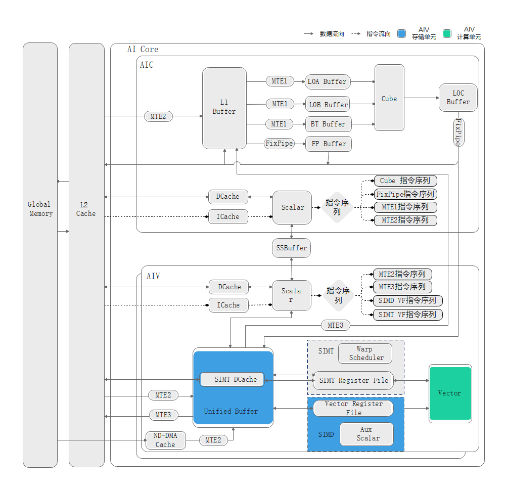

# Vector逻辑架构

## Vector逻辑架构说明

Vector计算单元专用于执行向量计算。如下图所示，高亮部分展示了Vector计算单元及其关联的存储单元。

<!-- npu="A3,910b" id1 -->
- 针对Atlas A3 训练系列产品/Atlas A3 推理系列产品、Atlas A2 训练系列产品/Atlas A2 推理系列产品，Vector逻辑架构如下图1所示。

  **图1** 向量计算单元架构图

  

  **表1** 向量计算单元关联的存储单元

  | 存储单元 | 说明 | 
  | --- | --- |
  | Unified Buffer | AI Core内部物理存储单元，通常用于存储向量计算的输入/输出数据。 |
<!-- end id1 -->

<!-- npu="950" id2 -->
- 针对Ascend 950PR/Ascend 950DT，Vector逻辑架构如下图2所示。

  **图2** 向量计算单元架构图

  

  **表2** 向量计算单元关联的存储单元

  | 存储单元 | 说明 | 
  | --- | --- |
  | Unified Buffer | AI Core内部物理存储单元，通常用于存储向量计算的输入/输出数据。 |
  | SIMD Register File | AI Core内部物理存储单元，在SIMD程序中，数据从Unified Buffer搬运到Register进行计算，产生的中间结果可以不用传回Unified Buffer，直接在寄存器计算。 |
<!-- end id2 -->

## Unified Buffer介绍

### Unified Buffer的通用约束说明

- Unified Buffer地址对齐约束，请参考[通用地址对齐约束](../../../通用说明和约束.md#通用地址对齐约束)。
- Unified Buffer地址重叠约束，请参考[通用地址重叠约束](../../../通用说明和约束.md#通用地址重叠约束)。

### Unified Buffer的内存结构与bank冲突

为了提高数据访问的效率和吞吐量，Unified Buffer采用了大小相等的内存模块（bank）结构设计。当多条读写指令同时访问Unified Buffer时，由于硬件资源的限制，这些指令不能同时执行，从而引发bank冲突。在这种情况下，指令需要排队等待资源，无法在一个指令周期内完成。

<!-- npu="A3,910b" id3 -->
- 针对Atlas A3 训练系列产品/Atlas A3 推理系列产品、Atlas A2 训练系列产品/Atlas A2 推理系列产品
  - Unified Buffer的内存结构

    **图3** Unified Buffer的内存结构图

    

    如图3所示，UB总大小为192KB，包含16个bank group（BG0 ~ BG15），每个bank group包含3个bank。每个bank大小为4KB，由128行组成，每行长度为32B。
    - **读写冲突**：读操作和写操作同时尝试访问同一个bank。
    - **写写冲突**：多个写操作同时尝试访问同一个bank group。
    - **读读冲突**：多个读操作同时尝试访问同一个bank group。

  - bank冲突优化

    可参考[避免bank冲突（NPU架构版本2201）](<https://gitcode.com/cann/asc-devkit/blob/master/docs/guide/算子实践参考/SIMD算子性能优化/内存访问/避免UB的bank冲突/避免bank冲突（NPU架构版本2201）.md>)。
<!-- end id3 -->

<!-- npu="950" id4 -->
- 针对Ascend 950PR/Ascend 950DT
  - Unified Buffer的内存结构

    **图4** Unified Buffer的内存结构图

    

    如图4所示，UB总大小为256KB，包含8个bank group（BG0 ~ BG7），每个bank group包含2个bank。每个bank大小为16KB，由512行组成，每行长度为32B。
    - **读写冲突**：读操作和写操作同时尝试访问同一个bank。
    - **写写冲突**：多个写操作同时尝试访问同一个bank group。
    - **读读冲突**：两个读操作同时尝试访问同一个bank，或者两个以上读操作同时尝试访问同一个bank group。
  
  - bank冲突优化

    可参考[避免bank冲突（NPU架构版本3510）](<https://gitcode.com/cann/asc-devkit/blob/master/docs/guide/算子实践参考/SIMD算子性能优化/内存访问/避免UB的bank冲突/避免bank冲突（NPU架构版本3510）.md>)。
<!-- end id4 -->
