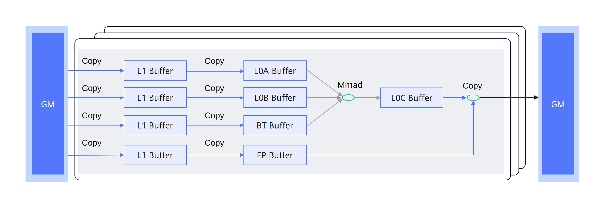

# 普通矩阵计算流程

Tensor API针对矩阵计算编程模型提供了两类接口，分别承载Cube核中各个通路的搬运能力和计算能力，如下图所示：

**图 1**  普通矩阵基础计算流程图  

1．通过Copy接口将A、B原始矩阵的Global Memory数据搬运到L1 Buffer中（如果存在Bias/随路量化，则同样通过Copy搬运到L1 Buffer中）。详细内容请参考矩阵计算的搬入。

2．通过Copy接口将A、B矩阵分别加载到L0A Buffer和L0B Buffer上准备计算（如果存在Bias/随路量化，则通过Copy将L1 Buffer中的Bias数据/量化系数数据搬运到BiasTable Buffer/Fixpipe Buffer上）。详细内容请参考矩阵计算的搬入。

3．通过Mmad接口对L0A Buffer、L0B Buffer、BiasTable Buffer上面的数据进行矩阵计算，并输出结果到L0C Buffer上。详细内容请参考Mmad计算。

4．通过Copy接口将L0C Buffer的数据进行处理并搬出到Global Memory，Copy接口可以利用Fixpipe Buffer数据进行如随路量化、Relu等操作。详细内容请参考矩阵计算的搬出。
