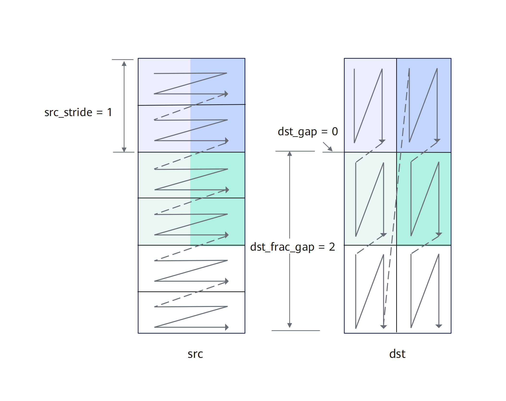
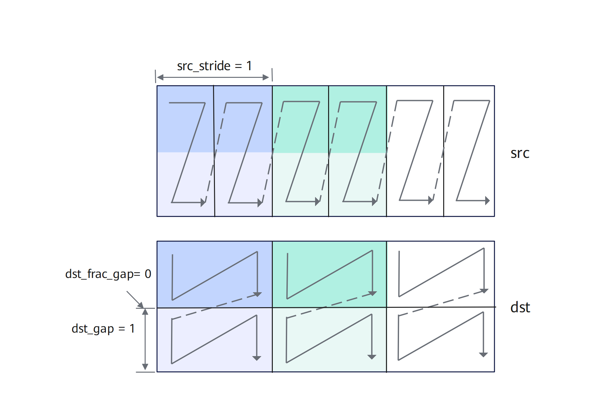
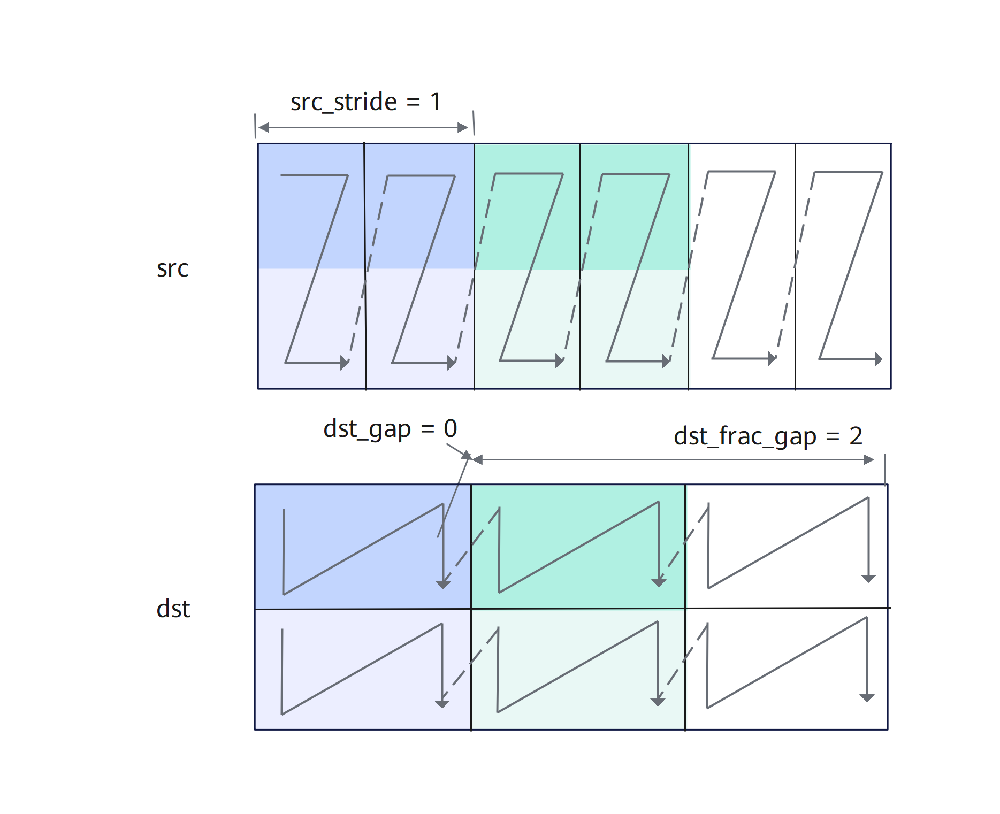
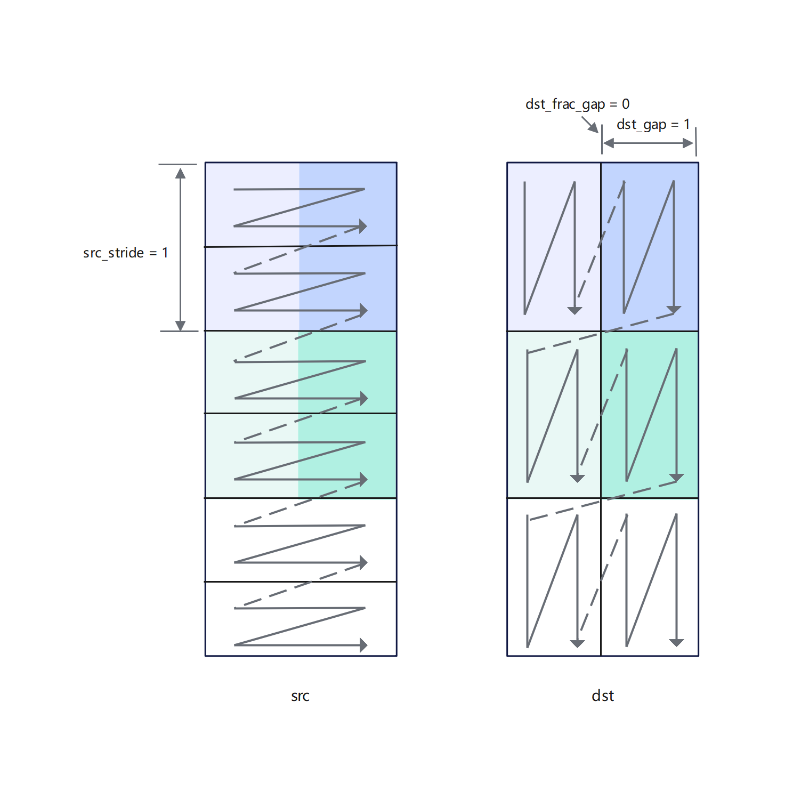

# asc_copy_l12l0b_trans

## 产品支持情况

| 产品     | 是否支持 |
| ----------- |:----:|
| Ascend 950PR/Ascend 950DT |    √     |

## 功能说明

该接口实现带转置的2D格式数据从L1 Buffer到L0B Buffer的加载。

下面通过示例来讲解接口功能和关键参数：下文图中一个N形或者一个Z形代表一个分形。

- 对于uint8_t/int8_t数据类型，每次迭代处理32 × 32 × 1B数据，可处理2个分形（一个分形512B），每次迭代中，源操作数中2个连续的16 × 32分形将被合并为1个32 × 32的方块矩阵，基于方块矩阵做转置，转置后分裂为2个16 × 32分形，根据目的操作数分形间隔等参数可以有不同的排布。

如下图示例：

- 共处理3072B的数据，每次迭代处理32 × 32 × 1B数据，需要3次迭代可以完成，repeat_time = 3；
- src_stride = 1，表示相邻迭代间，源操作数前一个方块矩阵与后一个方块矩阵起始地址的间隔为1（单位：32 × 32 × 1B），这里的单位实际上是拼接后的方块矩阵的大小；
- dst_gap = 1，表示相邻迭代间，目的操作数前一个迭代第一个分形的结束地址到下一个迭代第一个分形起始地址的间隔为1（单位：512B）；
- dst_frac_gap = 0，表示每个迭代内目的操作数前一个分形的结束地址与后一个分形起始地址的间隔为0（单位：512B）。


如下图示例：

- repeat_time和src_stride的解释和上图示例一致。
- dst_gap = 0，表示相邻迭代间，目的操作数前一个迭代第一个分形的结束地址和下一个迭代第一个分形起始地址无间隔。
- dst_frac_gap = 2，表示每个迭代内目的操作数前一个分形的结束地址与后一个分形起始地址的间隔为2（单位：512B）。


- 对于half/bfloat16_t数据类型，每次迭代处理16 × 16 × 2B数据，可处理1个分形（一个分形512B），每次迭代中，源操作数中1个16 × 16分形将被转置。
  - 因为每次迭代处理16 × 16 × 2B数据，需要3次迭代可以完成，repeat_time = 3；
  - src_stride = 1，表示相邻迭代间，源操作数前一个方块矩阵与后一个方块矩阵起始地址的间隔为1 （单位：16 × 16 × 2B）；
  - dst_gap = 0，表示相邻迭代间，目的操作数前一个迭代第一个分形的结束地址到下一个迭代第一个分形起始地址无间隔；
  - 该场景下，因为其分形即为方块矩阵，每个迭代处理一个分形，不存在迭代内分形的间隔，该参数设置无效。


- 对于float/int32_t/uint32_t数据类型，每次迭代处理16 × 16 × 4B数据，可处理2个分形（一个分形512B），每次迭代中，源操作数2个连续的16 × 8分形将被合并为1个16 × 16的方块矩阵，基于方块矩阵做转置，转置后分裂为2个16 × 8分形，根据目的操作数分形间隔等参数可以有不同的排布。
如下图示例：
  - 因为每次迭代处理16 × 16 × 4B数据，需要3次迭代可以完成，repeat_time = 3；
  - src_stride = 1，表示相邻迭代间，源操作数前一个方块矩阵与后一个方块矩阵起始地址的间隔为1（单位：16 × 16 × 4B），这里的单位实际上是拼接后的方块矩阵的大小；
  - dst_gap = 1，表示相邻迭代间，目的操作数前一个迭代第一个分形的结束地址到下一个迭代第一个分形起始地址的间隔为1（单位：512B）；
  - dst_frac_gap = 0，表示每个迭代内目的操作数前一个分形结束地址与后一个分形起始地址的间隔为0（单位：512B）。


如下图示例：
- repeat_time和src_stride的解释和上图示例一致。
- dst_gap = 0，表示相邻迭代间，目的操作数前一个迭代第一个分形的结束地址和下一个迭代第一个分形起始地址无间隔。
- dst_frac_gap = 2，表示每个迭代内目的操作数前一个分形结束地址与后一个分形起始地址的间隔为2（单位：512B）。


- 对于int4b\_t数据类型，每次迭代处理64\*64\*0.5B数据，可处理4个分形（一个分形512B），每次迭代中，源操作数中4个连续的16\*64分形将被合并为1个64\*64的方块矩阵，基于方块矩阵做转置，转置后分裂为4个16\*64分形，根据目的操作数分形间隔等参数可以有不同的排布。

    int4b\_t数据类型需要两个数拼成一个int8\_t或uint8\_t的数，拼凑的规则如下：

    

  如下图所示：
  - 共需要处理6144B的数据，每次迭代处理64\*64\*0.5B数据，需要3次迭代可以完成，repeat_time = 3；
  - src_stride = 1，表示相邻迭代间，源操作数前一个方块矩阵与后一个方块矩阵起始地址的间隔为1（单位：64\*64\*0.5B），这里的单位实际上是拼接后的方块矩阵的大小；
  - dst_gap = 1，表示相邻迭代间，目的操作数前一个迭代第一个分形的结束地址到下一个迭代第一个分形起始地址的间隔为1（单位：512B）；
  - dst_frac_gap = 0，表示每个迭代内目的操作数前一个分形的结束地址与后一个分形起始地址的间隔为0（单位：512B）。
  
  

  如下图示例：

  - repeat_time和src_stride的解释和上图示例一致。
  - dst_gap = 0，表示相邻迭代间，目的操作数前一个迭代第一个分形的结束地址和下一个迭代第一个分形起始地址无间隔。
  - dst_frac_gap = 2，表示每个迭代内目的操作数前一个分形的结束地址与后一个分形起始地址的间隔为2（单位：512B）。

  

## 函数原型

- 常规转置搬运

  ```cpp
  __aicore__ inline void asc_copy_l12l0b_trans(__cb__ bfloat16_t* dst, __cbuf__ bfloat16_t* src, uint16_t index_id, uint8_t repeat, uint16_t src_stride, uint16_t dst_gap, uint16_t dst_frac_gap, uint16_t src_frac_gap);
  __aicore__ inline void asc_copy_l12l0b_trans(__cb__ fp8_e4m3fn_t* dst, __cbuf__ fp8_e4m3fn_t* src, uint16_t index_id, uint8_t repeat, uint16_t src_stride, uint16_t dst_gap, uint16_t dst_frac_gap, uint16_t src_frac_gap);
  __aicore__ inline void asc_copy_l12l0b_trans(__cb__ fp8_e5m2_t* dst, __cbuf__ fp8_e5m2_t* src, uint16_t index_id, uint8_t repeat, uint16_t src_stride, uint16_t dst_gap, uint16_t dst_frac_gap, uint16_t src_frac_gap);
  __aicore__ inline void asc_copy_l12l0b_trans(__cb__ half* dst, __cbuf__ half* src, uint16_t index_id, uint8_t repeat, uint16_t src_stride, uint16_t dst_gap, uint16_t dst_frac_gap, uint16_t src_frac_gap);
  __aicore__ inline void asc_copy_l12l0b_trans(__cb__ float* dst, __cbuf__ float* src, uint16_t index_id, uint8_t repeat, uint16_t src_stride, uint16_t dst_gap, uint16_t dst_frac_gap, uint16_t src_frac_gap);
  __aicore__ inline void asc_copy_l12l0b_trans(__cb__ hifloat8_t* dst, __cbuf__ hifloat8_t* src, uint16_t index_id, uint8_t repeat, uint16_t src_stride, uint16_t dst_gap, uint16_t dst_frac_gap, uint16_t src_frac_gap);
  __aicore__ inline void asc_copy_l12l0b_trans(__cb__ int32_t* dst, __cbuf__ int32_t* src, uint16_t index_id, uint8_t repeat, uint16_t src_stride, uint16_t dst_gap, uint16_t dst_frac_gap, uint16_t src_frac_gap);
  __aicore__ inline void asc_copy_l12l0b_trans(__cb__ int8_t* dst, __cbuf__ int8_t* src, uint16_t index_id, uint8_t repeat, uint16_t src_stride, uint16_t dst_gap, uint16_t dst_frac_gap, uint16_t src_frac_gap);
  __aicore__ inline void asc_copy_l12l0b_trans(__cb__ uint32_t* dst, __cbuf__ uint32_t* src, uint16_t index_id, uint8_t repeat, uint16_t src_stride, uint16_t dst_gap, uint16_t dst_frac_gap, uint16_t src_frac_gap);
  __aicore__ inline void asc_copy_l12l0b_trans(__cb__ uint8_t* dst, __cbuf__ uint8_t* src, uint16_t index_id, uint8_t repeat, uint16_t src_stride, uint16_t dst_gap, uint16_t dst_frac_gap, uint16_t src_frac_gap);
  __aicore__ inline void asc_copy_l12l0b_trans(__cb__ int4b_t* dst, __cbuf__ int4b_t* src, uint16_t index_id, uint8_t repeat, uint16_t src_stride, uint16_t dst_gap, uint16_t dst_frac_gap, uint16_t src_frac_gap)
  __aicore__ inline void asc_copy_l12l0b_trans(__cb__ fp4x2_e2m1_t* dst, __cbuf__ fp4x2_e2m1_t* src, uint16_t index_id, uint8_t repeat, uint16_t src_stride, uint16_t dst_gap, uint16_t dst_frac_gap, uint16_t src_frac_gap);
  __aicore__ inline void asc_copy_l12l0b_trans(__cb__ fp4x2_e1m2_t* dst, __cbuf__ fp4x2_e1m2_t* src, uint16_t index_id, uint8_t repeat, uint16_t src_stride, uint16_t dst_gap, uint16_t dst_frac_gap, uint16_t src_frac_gap);
  ```

- 同步转置搬运

  ```cpp
  __aicore__ inline void asc_copy_l12l0b_trans_sync(__cb__ bfloat16_t* dst, __cbuf__ bfloat16_t* src, uint16_t index_id, uint8_t repeat, uint16_t src_stride, uint16_t dst_gap, uint16_t dst_frac_gap, uint16_t src_frac_gap);
  __aicore__ inline void asc_copy_l12l0b_trans_sync(__cb__ fp8_e4m3fn_t* dst, __cbuf__ fp8_e4m3fn_t* src, uint16_t index_id, uint8_t repeat, uint16_t src_stride, uint16_t dst_gap, uint16_t dst_frac_gap, uint16_t src_frac_gap);
  __aicore__ inline void asc_copy_l12l0b_trans_sync(__cb__ fp8_e5m2_t* dst, __cbuf__ fp8_e5m2_t* src, uint16_t index_id, uint8_t repeat, uint16_t src_stride, uint16_t dst_gap, uint16_t dst_frac_gap, uint16_t src_frac_gap);
  __aicore__ inline void asc_copy_l12l0b_trans_sync(__cb__ half* dst, __cbuf__ half* src, uint16_t index_id, uint8_t repeat, uint16_t src_stride, uint16_t dst_gap, uint16_t dst_frac_gap, uint16_t src_frac_gap);
  __aicore__ inline void asc_copy_l12l0b_trans_sync(__cb__ float* dst, __cbuf__ float* src, uint16_t index_id, uint8_t repeat, uint16_t src_stride, uint16_t dst_gap, uint16_t dst_frac_gap, uint16_t src_frac_gap);
  __aicore__ inline void asc_copy_l12l0b_trans_sync(__cb__ hifloat8_t* dst, __cbuf__ hifloat8_t* src, uint16_t index_id, uint8_t repeat, uint16_t src_stride, uint16_t dst_gap, uint16_t dst_frac_gap, uint16_t src_frac_gap);
  __aicore__ inline void asc_copy_l12l0b_trans_sync(__cb__ int32_t* dst, __cbuf__ int32_t* src, uint16_t index_id, uint8_t repeat, uint16_t src_stride, uint16_t dst_gap, uint16_t dst_frac_gap, uint16_t src_frac_gap);
  __aicore__ inline void asc_copy_l12l0b_trans_sync(__cb__ int8_t* dst, __cbuf__ int8_t* src, uint16_t index_id, uint8_t repeat, uint16_t src_stride, uint16_t dst_gap, uint16_t dst_frac_gap, uint16_t src_frac_gap);
  __aicore__ inline void asc_copy_l12l0b_trans_sync(__cb__ uint32_t* dst, __cbuf__ uint32_t* src, uint16_t index_id, uint8_t repeat, uint16_t src_stride, uint16_t dst_gap, uint16_t dst_frac_gap, uint16_t src_frac_gap);
  __aicore__ inline void asc_copy_l12l0b_trans_sync(__cb__ uint8_t* dst, __cbuf__ uint8_t* src, uint16_t index_id, uint8_t repeat, uint16_t src_stride, uint16_t dst_gap, uint16_t dst_frac_gap, uint16_t src_frac_gap);
  __aicore__ inline void asc_copy_l12l0b_trans_sync(__cb__ int4b_t* dst, __cbuf__ int4b_t* src, uint16_t index_id, uint8_t repeat, uint16_t src_stride, uint16_t dst_gap, uint16_t dst_frac_gap, uint16_t src_frac_gap)
  __aicore__ inline void asc_copy_l12l0b_trans_sync(__cb__ fp4x2_e2m1_t* dst, __cbuf__ fp4x2_e2m1_t* src, uint16_t index_id, uint8_t repeat, uint16_t src_stride, uint16_t dst_gap, uint16_t dst_frac_gap, uint16_t src_frac_gap);
  __aicore__ inline void asc_copy_l12l0b_trans_sync(__cb__ fp4x2_e1m2_t* dst, __cbuf__ fp4x2_e1m2_t* src, uint16_t index_id, uint8_t repeat, uint16_t src_stride, uint16_t dst_gap, uint16_t dst_frac_gap, uint16_t src_frac_gap);

  ```

## 参数说明

| 参数名              | 输入/输出 | 描述                                                                                                                                                                                               |
|:-----------------| :--- |:-------------------------------------------------------------------------------------------------------------------------------------------------------------------------------------------------|
| dst              | 输出 | 目的L0B Buffer地址。 |
| src              | 输入 | 源L1 Buffer地址。 |
| index_id | 输入 | 矩阵ID，搬运起始位置为源操作数中第几个分形。取值范围：[0, 65535]。 |
|repeat | 输入 | 迭代次数。<br> 对于位宽为4的数据类型，每次迭代处理4个分形，每个分形为16*64*0.5B数据；<br> 对于位宽为8的数据类型，每次迭代处理2个分形，每个分形为16*32*1B数据；<br>对于位宽为16的数据类型，每次迭代处理1个分形，每个分形为16*16*2B数据；对于位宽为32的数据类型，每次迭代处理4个分形，每个分形为16*8*4B数据。取值范围：[1, 255]。 |
| src_stride | 输入 | 相邻迭代间，源操作数前一个分形与后一个分形起始地址的间隔。单位为单个分形512B。取值范围：[0, 65535]。 |
| dst_gap | 输入 | 相邻迭代间，目的操作数前一个分形结束地址与后一个分形起始地址的间隔。单位为单个分形512B。取值范围：[0, 65535]。 |
| dst_frac_gap | 输入 | 每个迭代内目的操作数转置前一个分形结束地址与后一个分形起始地址的间隔。单位为512B。仅在数据位宽为4、8或32时有效。 |
| src_frac_gap | 输入 | 每个迭代内源操作数转置前一个分形结束地址与后一个分形起始地址的间隔。单位为512B。仅在数据位宽为4、8或32时有效。 |

## 返回值说明

无

## 流水类型

PIPE_MTE1

## 约束说明

- repeat=0表示不执行搬运操作。
- 开发者需要保证目的操作数转置后的分形没有重叠。
- 操作数地址重叠约束请参考[通用地址重叠约束](../../general_instruction.md#通用地址重叠约束)。

## 调用示例

```cpp
//设置源操作数和目的操作数，total_length 指参与计算的数据长度
constexpr uint64_t total_length = 512;
__cbuf__ int32_t src[total_length];
__cb__ int32_t dst[total_length];

// 设置搬运过程中的配置
uint8_t n = 64;
uint8_t nBlockSize = 32;
uint8_t repeat = n / nBlockSize;
uint16_t index_id = 0;
uint16_t src_stride = 1;
uint16_t dst_gap = 1;
uint16_t dst_frac_gap = 15;
uint16_t src_frac_gap = 8;

asc_copy_l12l0b_trans(dst, src, index_id, repeat, src_stride, dst_gap, dst_frac_gap, src_frac_gap);
```
