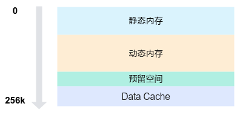

# 内存层级

## 整体内存资源<a name="zh-cn_topic_0000002571695539_section598391912124"></a>

在SIMD与SIMT混合编程场景下，整体内存资源如下图所示。核外的Global Memory是所有核的全局内存，容量最大，但访问效率最低。AIC的L1和AIV的UB是单核内的共享内存，容量较小，但访问效率较高。私有内存层最靠近计算单元，容量最小，访问效率最高。

**图 1** SIMD与SIMT混合编程内存层级  


在混合编程场景下，UB内存是SIMT VF和SIMD VF的共享内存。Vector Function切换时，UB上的数据不会被清除，因此可通过UB实现Vector Function间的通信。下文[UB划分](#ub划分)章节详细说明UB如何划分为静态内存、动态内存、Data Cache等区域；[数据通路](#数据通路)章节介绍混合编程场景下的整体数据通路，并说明并行流水间的数据同步和访问GM时的缓存一致性问题。

## UB划分<a name="ZH-CN_TOPIC_0000002563309890"></a>

UB内存空间总大小为256KB，按功能划分为四个主要区域。从低地址到高地址依次为静态内存、动态内存、预留空间和Data Cache，如下图所示。

**图 2** SIMD与SIMT混合编程UB内存分配  


### 内存空间说明<a name="zh-cn_topic_0000002571697985_section19291134194"></a>

1.  静态内存：从内存的起始地址分配一段指定大小的内存空间，其大小在编译时确定，不可动态修改。

    ```cpp
    // 静态内存通过数组分配，例如：
    __ubuf__ char static_buf[1024];
    ```

2.  动态内存：位于静态内存之后，其大小由[<<<...\>\>\>](核函数与VF函数.md#zh-cn_topic_0000002571578013_section156822920311)中的`dyn_ub_size`参数指定，可通过以下方式申请使用。

    -   使用动态数组分配。

        ```cpp
        // 动态内存通过动态数组分配，例如：
        extern __ubuf__ char dynamic_buf[];
        ```
    -   通过LocalMemAllocator的Alloc接口申请。

    由于动态内存均从静态内存结束位置之后开始分配，因此只能选择其中一种方式申请动态内存，否则可能导致地址空间重叠，从而引发未定义行为。

3.  预留空间：编译器和Ascend C的预留空间，大小固定为8KB。
4.  Data Cache：SIMT专有的Data Cache空间，可分配的内存大小范围为32KB到128KB，具体计算公式如下：

    ```
    Data Cache = UB总大小（256KB） - 静态内存 - 动态内存 - 预留空间（8KB）
    ```

    Data Cache作为访问GM内存的缓存，其大小会影响算子的访存效率。若Data Cache小于32KB，执行时会出现校验报错并退出，因此申请内存时需确保预留足够的Data Cache空间。

混合编程模式下，可在SIMT VF、SIMD VF和MainScalar执行空间申请静态内存和动态内存。MainScalar是指Device侧在VF函数外部的执行空间。下图为不同执行空间申请内存时对应的UB内存排布示意图。

**图 3** 不同执行空间的UB内存排布  


用户在申请静态内存和动态内存时需要注意：

-   多次申请的静态内存在UB上按一定的首地址对齐规则排布：
    -   默认情况下，申请到的静态内存首地址按照32B对齐；
    -   支持用户使用`__align__(N)`手动指定对齐，优先级高于默认对齐。
-   动态内存大小在`<<<...>>>`执行时动态配置，全局只有一份，因此不同执行位置申请的动态内存返回的首地址均相同。

## 数据通路

混合编程场景下，AIV核支持在SIMT VF、SIMD VF和MainScalar执行空间访问UB/GM，同时支持独立的UB到GM的MTE通路。整体数据通路如下图所示。

**图 4** SIMD与SIMT混合编程数据通路  


### 访问UB内存

对于UB内存，VF内读写UB使用Vector流水，MainScalar上读写UB使用Scalar流水，同时还存在UB与GM之间的MTE流水。由于这三条流水并行执行，若流水间存在数据依赖，需要做好同步。

### 访问GM内存

对于GM内存，SIMT VF和MainScalar对GM的读写会经过各自的Data Cache；同时，MTE流水也可能引发缓存数据一致性问题，具体如下：

-   在SIMT VF执行空间读GM时，可能存在缓存数据不一致的问题：
    -   写数据时，底层会确保数据立即写出到GM，从而确保其他通路读取到最新数据；
    -   读数据时，若访问的内存在SIMT DCache中命中，默认会读取Cache数据，可能导致读取到的数据与GM中的最新数据不一致。可使用`volatile`关键字获取最新数据，或使用`dcci()`接口刷新Cache。
-   在MainScalar执行空间通过Cache读写GM时，读写均可能存在一致性问题：
    -   写数据时，数据会先写入Cache，底层无法保证数据立即刷新到GM上，此时其他通路读取到的可能是旧数据；
    -   读数据时，若访问的内存在Cache中命中，将不会读取GM中的最新数据，可能导致读取到的数据失效。
