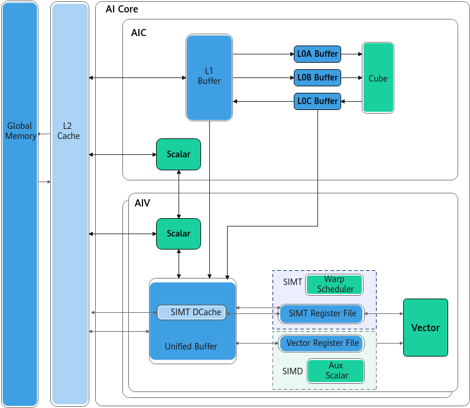
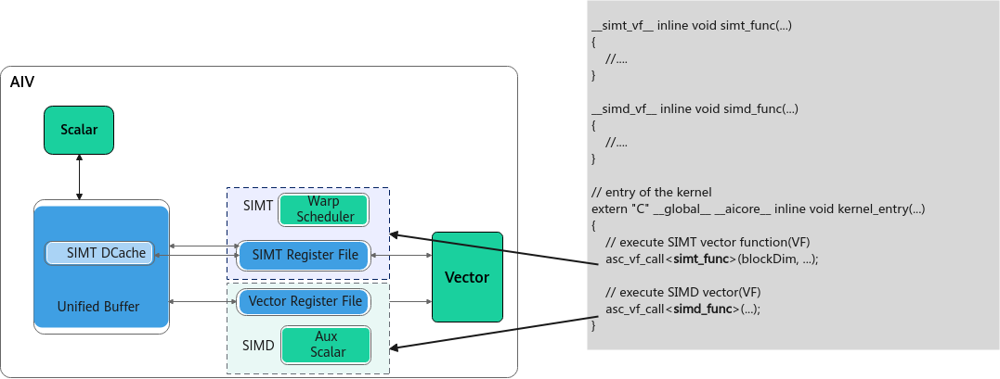

# 抽象硬件架构

Ascend C支持SIMD与SIMT混合编程，实现向量级并行与线程级并行的高效协同。AI Core包含AIC和AIV，其中AIV核支持SIMT、SIMD两种工作模式，因此可以实现AIV内SIMD与SIMT的混合编程，也支持AIV的SIMT与AIC的SIMD融合编程，整体硬件架构如下图所示：

**图1** SIMD与SIMT混合编程硬件架构示意图  

## Vector Function工作机制

如上图硬件架构所示，AIV核的计算单元包括SIMD和SIMT两种。针对这两种硬件计算单元，Ascend C抽象出了Vector Function的软件概念，用于表示在SIMT或SIMD硬件计算单元上执行的特定功能代码段。用户通过编写SIMD Vector Function或SIMT Vector Function来调用对应的执行单元完成计算任务，在算子核函数中调用不同类型的Vector Function，以实现SIMD/SIMT硬件单元的切换使用。

如下图和示例代码所示，simt\_func表示在SIMT硬件单元上执行的代码段，simd\_func表示在SIMD硬件单元上执行的代码段，代码段属性通过[\_\_simt\_vf\_\_](核函数与VF函数.md#zh-cn_topic_0000002571578013_section1780955884616)、[\_\_simd\_vf\_\_](../../../语言扩展层/SIMD-BuiltIn关键字.md#section192521344610)来标识。

**图2** SIMD与SIMT混合编程VF示意图  

AIV执行时，Scalar计算单元会将Vector Function发射到Vector Function Queue中，后续串行执行每个Vector Function，并与MTE异步执行。

### SIMD Vector Function

当AIV核处于SIMD工作模式时，执行模型遵从[Reg矢量计算方式](../../../编程模型/AI-Core-SIMD编程/基于指针的C语言编程/Reg矢量计算编程.md)，核内参与Reg矢量计算的硬件单元包括：

- **Reg矢量执行单元**：用于执行Reg矢量计算，从寄存器读取数据，完成计算后将结果写回寄存器。
- **DMA单元**：用于执行Reg矢量搬运，负责在寄存器和UB之间搬运数据。
- **Aux Scalar**：处理Reg矢量执行单元和Reg搬运单元所需的标量计算（例如地址计算）。

Reg矢量执行单元、DMA单元和Aux Scalar虽属于不同的硬件执行单元，但是在实际执行时都归属PIPE_V流水。这一架构带来两个直接结果：

1. 有寄存器依赖时，由硬件按指令顺序保证数据依赖正确性，用户无需显式插入同步；但跨寄存器对同一UB区域的读写需要显式插入同步，搬运单元与计算单元之间没有自动顺序约束。
2. Reg矢量执行单元和DMA单元在没有数据依赖时可以**同时发射、并行执行**。

**图3** SIMD Reg矢量计算示意图  

### SIMT Vector Function

当AIV核处于SIMT工作模式时，执行模型遵从由Thread、Block、Grid组成的[线程架构](../../../编程模型/AI-Core-SIMT编程/线程架构.md)。一个SIMT VF对应一个线程块（Block）的执行上下文，线程块内线程按线性线程号划分为多个Warp，每个Warp包含32个线程。

Warp内线程共享同一条指令流，各线程维护独立的线程索引、寄存器和栈等执行状态。硬件根据线程活跃掩码发射指令：当Warp内线程控制流一致时，可保持较高执行效率；发生分支发散时，硬件会按不同分支路径分批执行活跃线程，有效并行度随之下降。

**图4** SIMT线程架构示意图  

