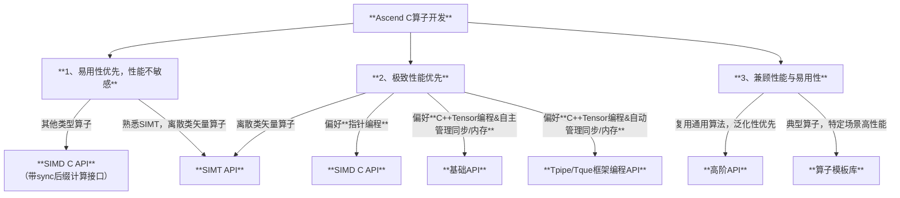

# Ascend C多层级编程接口选择参考

欢迎使用 [Ascend C](https://www.hiascend.com/cann/ascend-c) 进行昇腾AI处理器算子开发。Ascend C不仅致力于**开放芯片完备编程能力支撑实现极致性能**，同时通过多层级编程API设计，让您能够根据项目需求、团队技能与性能目标，灵活选择最合适的API，在开发效率与运行性能之间取得最佳平衡。

---

## 设计目标

Ascend C的设计目标可概括为 **“高性能、完备性、易编程、可调试和兼容性”**。其通过对C/C++语言标准进行最小化扩展，既支持基于指针的C语言开发习惯，也支持基于Tensor的C++编程范式，在支撑昇腾算子高效开发的同时，实现与现有生态的无缝衔接，保障开发体验的一致性。

我们秉持以下核心理念：
- **没有银弹**：不同场景对性能与开发效率的要求各异，单一接口无法在所有场景下实现最优适配；
- **渐进式学习**：新手可从易用性接口入手快速验证算法；专家则可向下钻取、精细调优，借助复杂接口充分释放硬件潜能。

## API层级

Ascend C提供三类接口，均支持底层完备编程能力：

| API层级 | 语言 | 特点 | 目标用户 | 主要用途 |
|---------|------|------|----------|----------|
| **Tpipe/Tque框架编程API** | C++ | 基于 **Tensor** 编程 通过 Tpipe/Tque 框架统一管理内存与同步 | 算子库开发者 | 借助框架自动管理同步与内存， 提升编程易用性 |
| **基础API** | C++ | 基于 **Tensor** 编程，提供 **C++ 基础完备编程能力** 通过 MakeTensor / LocalMemoryAllocator 分配 Tensor，自主管理同步 | 算子库开发者 | 自主管理同步与内存， 匹配 C++ Tensor 开发习惯，支撑极致性能 |
| **语言扩展层 SIMD & SIMT API** | C | 基于 **指针** 编程，提供 **C 基础完备编程能力** 通过数组 `[]` 分配内存，自主管理同步 | 算子库开发者 | 自主管理同步与内存， 匹配 C 语言开发习惯，支撑极致性能 |

此外，Ascend C提供高阶 API 和算子模板库以进一步提升算子开发效率。

| API层级 | 目标用户 | 主要用途 |
|---------|----------|----------|
| **算子模板库 (CATLASS / ATVOSS 等)** | 算法开发人员 | 基于典型算子实现进行自定义扩展，满足特定场景高性能需求 |
| **高阶API** | 算法开发人员 | 复用通用单核算法，快速完成算法验证 |

---

## 如何快速选择对应层级API？

以下决策流程图可帮助您快速定位最适合的 API 层级：

> 建议所有的算子均基于 **<<<>>>调用和Host/Device混合编译** 方式开发

也可参考以下关键维度进行快速决策：

| 关键因素 | 推荐层级 | 理由 |
|----------|----------|------|
| **离散矢量算子** | SIMT API | 充分发挥 SIMT 在离散场景的优势，同时匹配业界编程习惯 |
| **基于指针的完备编程能力** | SIMD C API | 匹配 C 语言开发习惯，支撑实现极致性能 |
| **基于 C++ Tensor 的完备编程能力** | 基础API | 匹配 C++ Tensor 开发习惯，支撑实现极致性能 |
| **快速算法验证** | 高阶API 或 算子模板库 | 封装了通用算法的良好泛化实现，开发效率高 |

---

## 层级详细介绍

### 语言扩展层 C API（SIMD & SIMT）

**特点**
- 匹配业界传统 C 语言算子开发习惯，支持数组内存分配、指针计算接口，采用 `asc_xxx` 前缀的 snake_case 命名风格；
- SIMT API 编程模型遵循业界通用开发习惯，降低学习曲线；
- SIMD API 提供易用的连续计算接口，可支撑绝大多数算子开发诉求，例如 `asc_add(__ubuf__ half* dst, __ubuf__ half* src0, __ubuf__ half* src1, uint32_t count)`；
- 为提升快速入门用户的易用性，SIMD API 简化同步管理，额外提供带 `_sync` 后缀的同步操作接口，如 `asc_add_sync(...)`；
- 面向极致性能场景，SIMD API 提供带 `repeat` / `stride` 参数的高级计算接口，支持灵活控制数据布局与计算模式。

**适用场景**
- 熟悉传统 C 语言开发习惯的算子开发者；
- 具备 SIMT 编程经验、希望快速迁移至 NPU 环境的开发者；
- 需要榨取硬件极致性能的生产环境算子开发；
- 希望借助带 `sync` 后缀的计算接口快速进行算法验证的开发者。

**示例**
- [SIMD Add 算子示例（带同步计算接口）](../../examples/02_simd_c_api/00_introduction/01_add/c_api_sync_add/c_api_add.asc)
- [SIMT Gather 算子示例（匹配业界习惯）](../../examples/03_simt_api/00_introduction/01_gather/basic_gather/gather_1d/gather_1d.asc)
- 更多样例请参考 [examples 目录](https://gitcode.com/cann/asc-devkit/tree/master/examples)

---

### 基础API：基于 Tensor 的单指令抽象

**特点**
- 基于 Tensor 与数据类型对 NPU 指令进行抽象，提供 Tensor 编程模型；
- 提供独立于 `Tque` / `Tpipe` 之外的内存分配与同步接口，支持开发者基于 Tensor 自主管理资源；
- 扩展 Tensor 支持 `Layout` 概念，通过统一的数据布局表达简化计算接口，与业界 Tensor 编程体验保持一致。
- 框架编程 API：引入 `Tque` / `Tpipe` 框架，借鉴 C++ `Queue` 的设计理念，简化 NPU 的同步与内存管理。

**适用场景**
- 熟悉业界基于 C++ Tensor 开发习惯的算子开发者；
- 需要在生产环境中开发极致性能算子，同时希望保持代码可维护性与可扩展性的场景。

**示例**
- [基于 Tque / Tpipe 自动管理内存与同步的 SIMD Add 算子示例](../../examples/01_simd_cpp_api/00_introduction/01_add/add_tpipe_tque/add_tpipe_tque.asc)
- [基于 LocalMemoryAllocator 自主管理内存与同步的 SIMD Add 算子示例](../../examples/01_simd_cpp_api/00_introduction/01_add/add/add.asc)
- 基于 Layout 的 Tensor API 示例（待补充）

---

### 高阶API：单核公共算法实现

**特点**
- 封装通用的单核算法实现，提供良好的泛化性能；
- 在典型网络场景下亦可实现接近极致的性能。

**适用场景**
- 快速验证算法可行性，对特定场景的极致性能要求不高；
- 希望复用成熟算法实现、缩短开发周期的场景。

**示例**
- [Softmax API 示例](../../examples/01_simd_cpp_api/04_advanced_api/01_activation/softmax/softmax.asc)
- [Matmul API 示例](../../examples/01_simd_cpp_api/04_advanced_api/00_matmul)

---

### 算子模板库：算子实现样例

**特点**
- 提供特定场景下典型算子的端到端完整实现，作为最佳实践参考；
- 通常针对特定场景进行极致优化，泛化性能并非首要目标。

**适用场景**
- 需要对典型算子进行自定义扩展，快速适配特定业务场景。

**示例**
- Vector 类算子模板库：[ATVC](https://gitcode.com/cann/atvc)、[ATVOSS](https://gitcode.com/cann/atvoss)
- Cube 类算子模板库：[CATLASS](https://gitcode.com/cann/catlass)

---

## 总结

Ascend C多层级接口设计的核心理念是：让您**始终使用最合适的编程范式，而非被动适应单一抽象**。无论您是追求极致性能的底层专家，还是希望快速验证算法的原型开发者，都能在Ascend C的层级化 API 生态中找到得心应手的工具。

立即开始您的算子编程之旅！如有疑问，欢迎参考Ascend C详细文档或社区示例，我们将持续致力于让 NPU 的强大算力对您触手可及、高效易用。
