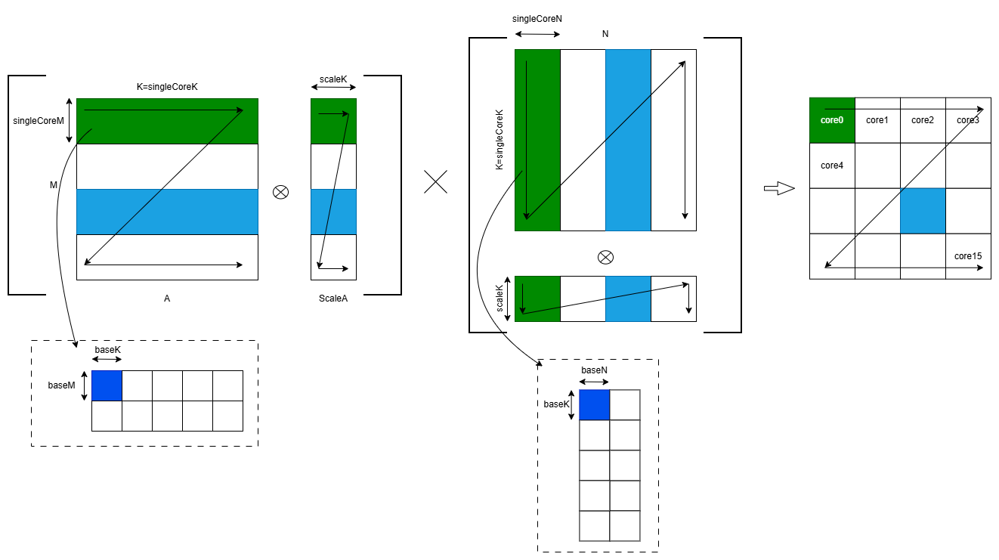

# 基于AscenC 高阶API的MxFP4矩阵乘法多场景示例

## 概述

本样例基于 Ascend C 高阶 API，实现低比特浮点数的 MxFP4 矩阵乘法。通过编译参数 `SCENARIO_NUM` 选择不同场景，高阶API中使用常量化tiling策略，tiling 参数在编译期固定。

## 支持的产品

- Ascend 950PR/Ascend 950DT

## 目录结构介绍

```
├── adv_api_practice
│   └── scripts
│       ├── gen_data.py         // 输入数据和真值数据生成脚本文件
│       └── verify_result.py    // 真值对比文件
│   ├── CMakeLists.txt          // 编译工程文件
│   ├── data_utils.h            // 数据读入写出函数
│   └── matmul_mxfp4_adv_api.asc        // Ascend C样例实现 & 调用样例
│   └── README.md               // 样例说明文档
```

## 样例规格
本样例实现固定 shape 为 `7168 x 7168 x 7168` 的 MxFP4 矩阵乘法，输出数据类型为 `bfloat16_t`。通过两组不同的tiling参数演示不同的性能：
- 场景1：M=K=N=7168，16核切分为 4 x 4，每核处理 1792 x 7168 x 1792，baseM/K/N 取 128 用作常量化 tiling 的基础 tile 块
- 场景2：M=K=N=7168，16核切分为 4 x 4，每核处理 1792 x 7168 x 1792，baseM/K/N 取 256 用作常量化 tiling 的基础 tile 块


### 输入输出format

  

| 输入/输出 | 逻辑形状 | 数据类型 | 数据排布类型 | 说明 |
|------|------|----------|------|------|
| A | `[M, K]` | `fp4x2_e1m2_t` | ND | 左矩阵，每个字节打包 2 个 fp4 元素 |
| scaleA | `[M, scaleK]` | `fp8_e8m0_t` | ND | A 矩阵的缩放因子，A矩阵在K 方向每 32 个元素共享一个 scale |
| B | `[N, K]` | `fp4x2_e1m2_t` | ND | 右矩阵，按 `[N, K]` 形式输入 kernel |
| scaleB | `[N, scaleK]` | `fp8_e8m0_t` | ND | B 矩阵的缩放因子，B矩阵在K 方向每 32 个元素共享一个 scale |
| C | `[M, N]` | `bfloat16_t` | ND | 输出矩阵 |

- 四路输入的数据排布格式如下图所示：

  

其中：
- 两个`fp4x2_e1m2_t`打包存储在一个字节中，因此当数据类型为`fp4`时，K 需要为偶数
- `scaleK = align_even(ceil(K / 32))`，表示先向上整除再对齐到 2 的倍数。由于硬件约束要求 scale 数据在 K 方向满足 2Byte 连续对齐，因此 scaleK 必须为偶数
- 由于硬件约束，当 scaleB 矩阵为 `[scaleK, N]` 输入时，需要 K 方向 2 Byte连续，因此推荐 ScaleB 采用`[N, scaleK]`输入

### 关键参数说明

| 参数 |  | 说明 |
|------|----|------|
| `M` |  | 矩阵 M 维度规模 |
| `N` |  | 矩阵 N 维度规模 |
| `K` |  | 矩阵 K 维度规模 |
| `singleCoreM` |  | 单核 M 方向计算范围 |
| `singleCoreN` |  | 单核 N 方向计算范围 |
| `singleCoreK` |  | 单核 K 方向计算范围 |
| `baseM` |  | Cube 计算基本块 M 维度大小 |
| `baseK` |  | Cube 计算基本块 K 维度大小 |
| `baseN` | | Cube 计算基本块 N 维度大小 |
| `usedCoreNum` |  | 使用核数 |

- 参数如下图所示：
  

## 编译运行

在本样例根目录下执行如下步骤，编译并执行样例。
- 配置环境变量  
  请根据当前环境上CANN开发套件包的安装方式，选择对应配置环境变量的命令。
  - 默认路径，root用户安装CANN软件包
    ```bash
    source /usr/local/Ascend/cann/set_env.sh
    ```
  - 默认路径，非root用户安装CANN软件包
    ```bash
    source $HOME/Ascend/cann/set_env.sh
    ```
  - 指定路径install_path，安装CANN软件包
    ```bash
    source ${install_path}/cann/set_env.sh
    ```

- 样例执行

```bash
SCENARIO_NUM=1
mkdir -p build && cd build;   # 创建并进入build目录
python3 ../scripts/gen_data.py   # 生成测试输入数据
cmake -DCMAKE_ASC_ARCHITECTURES=dav-3510 -DSCENARIO_NUM=$SCENARIO_NUM ..;make -j;  # 编译工程
./demo                        # 执行编译生成的可执行程序
python3 ../scripts/verify_result.py output/output.bin output/golden.bin   # 验证输出结果是否正确
```

- 编译选项说明

  | 参数 | 说明 | 可选值 | 默认值 |
  |------|------|---------|--------|
  | CMAKE_ASC_ARCHITECTURES | NPU硬件架构 | dav-3510 | dav-3510 |
  | SCENARIO_NUM | 样例场景编号 | 1, 2 | 1 |

- 执行结果

  执行结果如下，说明精度对比成功：
  ```bash
  test pass!
  ```

## 性能分析

使用 `msprof` 工具获取详细性能数据：

```bash
msprof ./demo   # 分析性能
```

当前目录下会生成PROF_前缀的文件夹，`mindstudio_profiler_output`目录保存Host和各个Device的性能数据汇总，性能数据分析推荐查看该目录下文件

```bash
PROF_xxxx_XXXXXX
├── device_{id}
└── host
└── mindstudio_profiler_log
└── mindstudio_profiler_output    # 保存Host和各个Device的性能数据汇总
    ├── msprof_*.json
    ├── xx_*.csv
    └── README.txt
```
查看具体的性能分析结果：
```
# 查看Task Duration 以及各项数据
cat ./PROF_*/mindstudio_profiler_output/op_summary_*.csv
```
### 性能指标说明

| 指标 | 说明 |
|------|------|
| Task Duration(μs) | 整个任务执行的总时间，算子执行时间以该参数为准 |
| Block Num | 使用的核数（Block数量） |
| aicore_time(μs) | AI Core的平均执行时间 |
| aic_mac_time(μs) | Cube计算单元的执行时间 |
| aic_mac_ratio | Cube计算单元的时间占比，反映计算单元利用率 |
| aic_scalar_time(μs) | Scalar标量计算单元的执行时间 |
| aic_scalar_ratio | Scalar标量计算单元的时间占比 |
| aic_mte1_time(μs) | MTE1（L1到L0A/L0B搬运）的执行时间 |
| aic_mte1_ratio | MTE1的时间占比，反映L1到L0的数据搬运压力 |
| aic_mte2_time(μs) | MTE2（GM到L1搬运）的执行时间 |
| aic_mte2_ratio | MTE2的时间占比，反映GM到L1的数据加载压力 |
| aic_fixpipe_time(μs) | FixPipe（L0C到GM搬运）的执行时间 |
| aic_fixpipe_ratio | FixPipe的时间占比，反映结果写回的访存压力 |

### Cube理论计算性能公式

本样例的性能数据在 Ascend 950PR 上运行得到，该处理器的主频为 1.65GHz，对于 MX-FP4 的数据类型，每 cycle 处理 16×64×16 次乘加运算。

Cube 理论运算时间 $T_{cube}$ 为：单位 s

$$T_{cube} = \frac{M \times N \times K}{16 \times 64 \times 16 \times 1.65 \times 10^9 \times \text{核数}}$$
